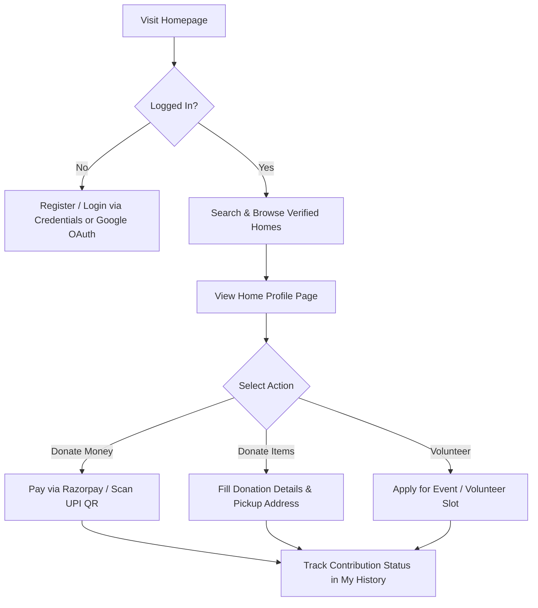
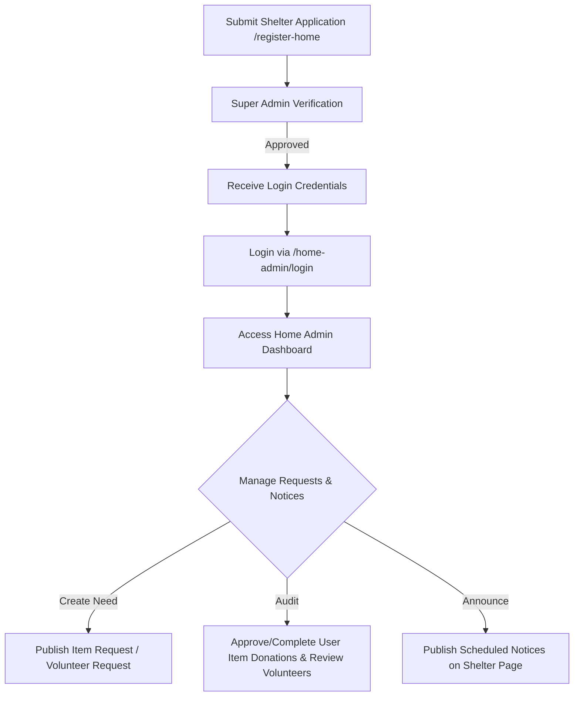
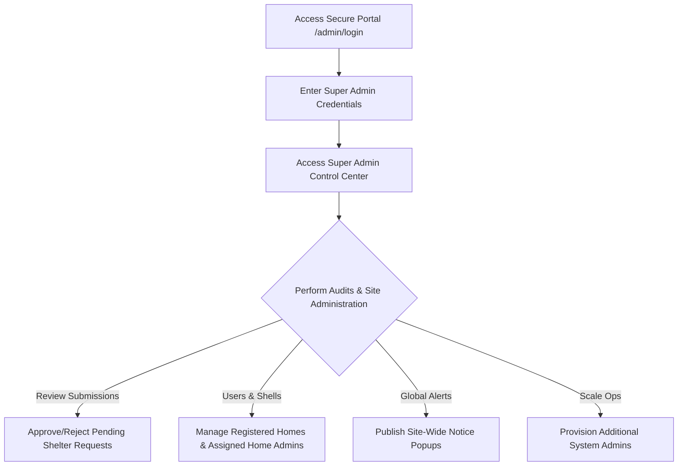
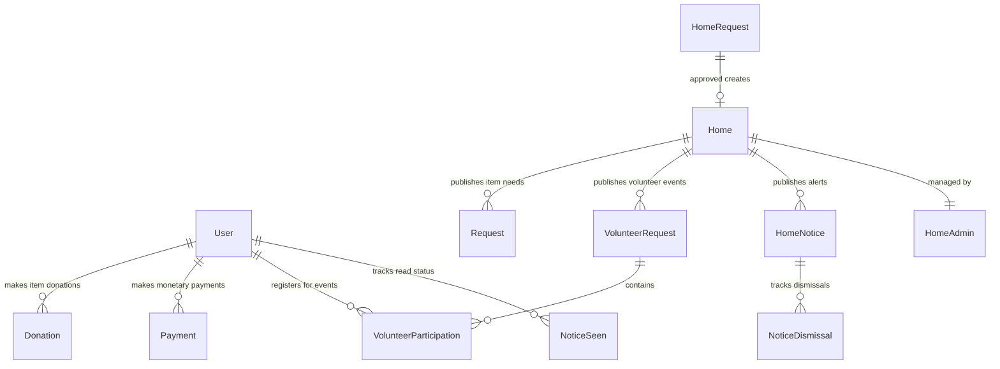

# 🕊️ CareConnect

CareConnect is a professional, high-fidelity platform designed to bridge the gap between generous donors, passionate volunteers, and verified shelter homes (orphanages and old-age homes). Built using **Next.js 14 (App Router)**, **Tailwind CSS**, and **MongoDB**, it provides role-based workspaces for donors, shelter admins, and super admins to facilitate secure monetary donations (via Razorpay and direct UPI), item contributions, and volunteering event coordination.

---

## 🛠️ Tech Stack & Key Technologies

| Technology | Purpose | Description |
| :--- | :--- | :--- |
| **Next.js 14** | Core Framework | Utilizes React Server Components (RSC) and client-side caching for fast rendering. |
| **Tailwind CSS** | Styling System | Features premium dark modes, gradient accents, frosted glassmorphism overlays, and interactive hover effects. |
| **MongoDB & Mongoose** | Database & ORM | Implements structured schemas for users, shelter registrations, notices, payments, and event registrations. |
| **Razorpay API** | Payment Gateway | Implements secure merchant-level transactions with verification signatures. |
| **UPI deep-linking** | Mobile Payments | Generates automatic `upi://pay` URI schemes along with base64-encoded QR codes. |
| **JWT & NextAuth.js** | Authentication | Supports manual credentials and Google OAuth with role-restricted token validation. |

---

## 👥 Roles & System Workflows

CareConnect operates on a strict Role-Based Access Control (RBAC) mechanism. Below are the workflows and interface capabilities for each user type:

### 1. Standard User (Donor / Volunteer)
The standard user experience centers on discovery, donation, and volunteer engagement.

#### 🔄 User Flow:


#### 🖥️ Interface Details & Features:
*   **Search and Discovery Panel:** A search engine allowing donors to filter verified homes by Name, Location, or Type (`orphanage` vs `oldage`).
*   **Shelter Profiles (`/homes/[id]`):** Details the shelter's mission, location, current requirements, and contact channels.
*   **Flexible Donations:**
    *   **Monetary:** Standardized integration with Razorpay checkout and a UPI modal displaying the shelter's custom VPA QR code (supporting mobile deep links).
    *   **In-Kind/Items:** Allows users to donate items (e.g. food, clothing, books) by specifying categories, quantity, and a physical pickup address.
*   **Volunteer Portal:** Lists event listings published by shelters, letting users join with a single click.
*   **Announcements HUD:** Features site-wide popups from Super Admins and specific shelter updates from Home Admins. Uses localized dismissal tracking (`localStorage` or database logs) to prevent repetitive popups.
*   **Personal Ledger (`/user/history`):** A history log detailing monetary donation statuses, item pickup progress (Pending, Accepted, Completed), and registered volunteering events.

---

### 2. Orphanage/OldAgeHome Admin (Home Admin)
Home Admins oversee shelter operations, manage user donations, and schedule targeted alerts for their specific shelter.

#### 🔄 User Flow:


#### 🖥️ Interface Details & Features:
*   **Digital Onboarding (`/register-home`):** Enables new shelters to apply by providing administrative credentials, official documentation URLs, UPI virtual payment addresses (VPA), and base64-encoded QR code images.
*   **Management Dashboard (`/home-admin/dashboard`):**
    *   **Need Publisher:** Form endpoints to post item donation requests (specifying category, name, and amount) and volunteer events (specifying datetime, location, and volunteer headcount).
    *   **Received Item Ledger:** Tracks user donations. Admins can update status states (`Pending` ➡️ `Accepted` ➡️ `Completed`).
    *   **Volunteers Registry:** Displays lists of registered volunteers for scheduled events.
*   **Shelter Notices Panel (`/admin/homes/[id]/notices`):**
    *   Lets admins schedule notices (with HTML content formatting) with `startAt` and `endAt` dates.
    *   Configure notices with priority status (`high`, `medium`, `low`) and `showOnce` dismissible alerts.

---

### 3. Super Admin
Super Admins act as the compliance and oversight body, managing system configuration and approving new shelter listings.

#### 🔄 User Flow:


#### 🖥️ Interface Details & Features:
*   **Administrative Access (`/admin/login`):** An isolated, secure login page for authorized administrative staff.
*   **Control Center (`/admin/dashboard`):** Displays platform analytics (total users, verified shelters, ongoing donation cycles, and global metrics).
*   **Verification Queue (`/admin/home-requests`):** Review pending onboarding registrations. Approving creates the shelter entry and corresponding `HomeAdmin` user credentials.
*   **Directory Management:**
    *   **Shelters Registry (`/admin/homes`):** Direct update/edit controls for all registered shelter entries.
    *   **Admins Registry (`/admin/homeadminsList`):** Manage administrative users linked to individual shelters.
*   **Site-Wide Notice Manager (`/admin/notices`):** Publish priority notices across all system views. Supports custom duration, enabling/disabling, priority-based coloring, and frequency constraints (`one_time` seen checks or `every_visit`).

---

## 🗄️ Database Schema Relationships

CareConnect uses Mongoose models to handle data relationships:



### Schemas Summary:
1.  **`User`**: Supports password login and Google OAuth.
2.  **`Home`**: Contains shelter type, description, and payment details (base64 QR / UPI VPA).
3.  **`HomeAdmin`**: Linked to a specific `Home` document to allow workspace management.
4.  **`HomeRequest`**: An onboarding application containing document uploads and contact info.
5.  **`Donation`**: Represents physical item offerings (food, clothing, books) containing pickup details and status.
6.  **`Payment`**: Logs monetary donations via Razorpay parameters.
7.  **`Request`**: Item requests published by shelters.
8.  **`VolunteerRequest`**: Scheduled events published by shelters.
9.  **`VolunteerParticipation`**: Many-to-many table linking `User` and `VolunteerRequest` with a unique index to prevent duplicate sign-ups.
10. **`Notice` & `NoticeSeen`**: Site-wide announcements and their read status logs.
11. **`HomeNotice` & `NoticeDismissal`**: Shelter-specific alerts and their dismissal logs.

---

## 🔌 API Endpoints Reference

### Auth & Accounts
*   `POST /api/auth/register` — Standard user registration.
*   `POST /api/auth/login` — Standard user login (custom credentials).
*   `GET /api/users/me` — Retrieve active profile.
*   `POST /api/home-admin/login` — Authenticates home admin and returns JWT + home details.

### Homes & Onboarding
*   `POST /api/homes/request` — Submit onboarding application (`HomeRequest`).
*   `GET /api/homes` — List verified homes.
*   `GET /api/homes/[id]` — Retrieve detailed home profile (including base64 QR code and UPI VPA).
*   `PATCH /api/homes/[id]` — Update home configurations/QR (Home Admin/Super Admin).
*   `GET /api/admin/home-requests` — List pending onboarding requests (Super Admin).
*   `POST /api/admin/home-requests/[id]/verify` — Approve or reject onboarding requests.

### Notices & Alerts
*   `GET /api/notices` — Fetch active site-wide announcements.
*   `POST /api/notices` — Mark a site-wide notice as read.
*   `GET /api/homes/[id]/notices` — Fetch active alerts for a specific shelter.
*   `POST /api/homes/[id]/notices/[nid]/dismiss` — Dismiss a shelter alert.
*   `POST /api/admin/notices` — Create site-wide notice (Super Admin).
*   `POST /api/homes/[id]/notices` — Create shelter-specific notice (Home Admin).

---

## ⚙️ Configuration & Installation

### 1. Environment Configuration
Create a `.env.local` file in the root directory and configure the variables:

```env
# Database connection
MONGODB_URI=your_mongodb_connection_string

# Authentication secret
JWT_SECRET=your_jwt_signing_token
NEXTAUTH_SECRET=your_nextauth_signing_token

# Razorpay payments gateway config
RZP_KEY=your_razorpay_key
RZP_SECRET=your_razorpay_secret

# Storage configurations (for documentation / photos)
CLOUD_STORAGE_PATH=/mnt/data
```

### 2. Install Dependencies
```bash
npm install
```

### 3. Start Development Server
```bash
npm run dev
```
Open [http://localhost:3000](http://localhost:3000) to view the application interface.

---

## 📁 Project Structure

```
├── app/
│   ├── admin/                # Super Admin page routing
│   │   ├── dashboard/        # Global analytics & management
│   │   ├── home-requests/    # Onboarding approval flow
│   │   ├── notices/          # Global notices dashboard
│   │   └── homes/            # Shelter details editor
│   ├── home-admin/           # Home Admin page routing
│   │   └── dashboard/        # Needs registry, donations, & volunteers
│   ├── homes/                # Public view of verified homes
│   │   └── [id]/             # Home profiles & donation modals
│   ├── user/                 # Standard User accounts
│   │   ├── history/          # User contribution log
│   │   ├── login/
│   │   └── register/
│   ├── components/           # Reusable UI elements (Navbar, Modals, Popups)
│   └── api/                  # API routing matching page functions
├── models/                   # Mongoose DB schema definitions
├── lib/                      # Auth utilities & MongoDB connector
└── public/                   # Shared image assets
```
